## Why this project
On this project, I wanted an introduction to 3D and learning the basic of :
- the creation of an 3D object
- the animation of an 3D object
- the diffent textures and lighting
- the integration of a 3D object with a website

## What I learned
While this is a really simple project, I could figure out a couple of things :
1. The position in space and the importance of perspective
2. The combination of materials like glass, fresnel effect and matcap
3. The animation frame by frame and the type of transitions
4. Hangling events like screen resizing

## My Process

### Creating the blob
1. Create a sphere\
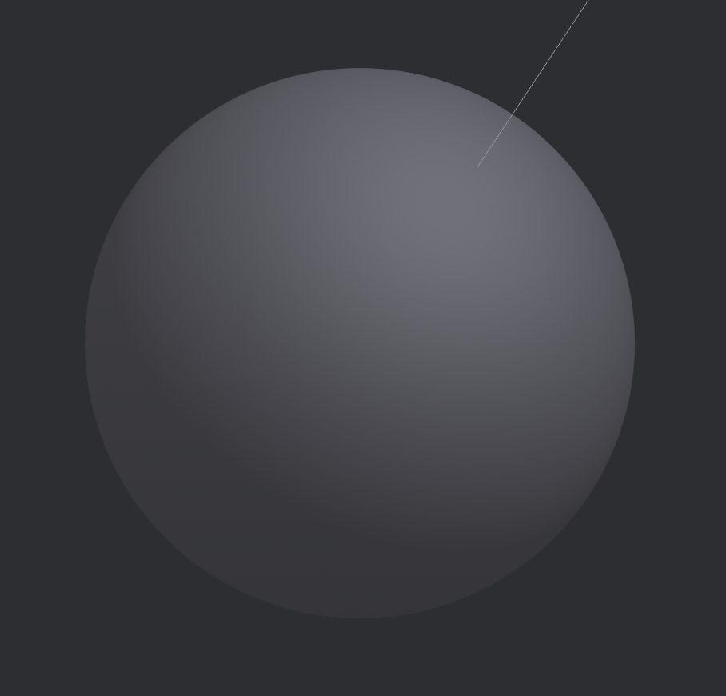
3. Add a material "displace" to morph your sphere\
   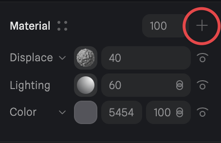
      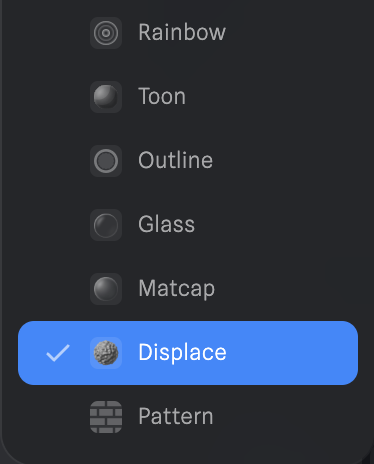
   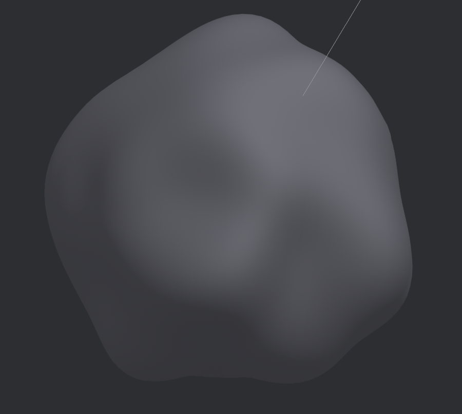
5. Make the color of the sphere transparant (watch out it will disapear 🫥)\
   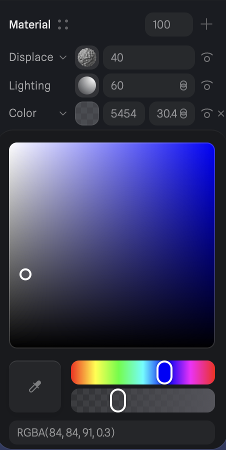
      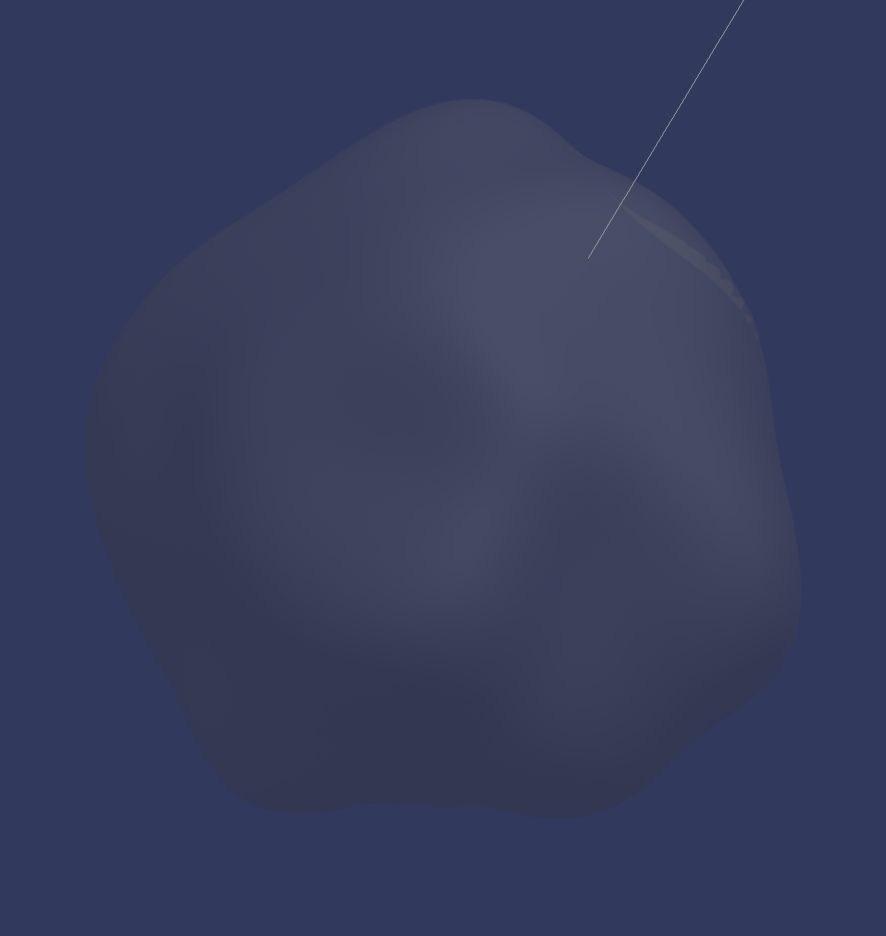
7. Add the material "glass"\
   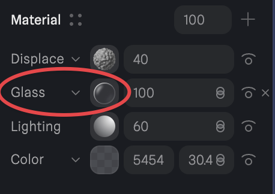
9. Add the material "Fresnel" and you can change the intensity for better result\
    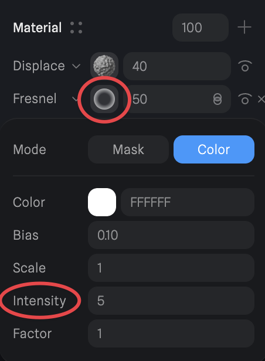
      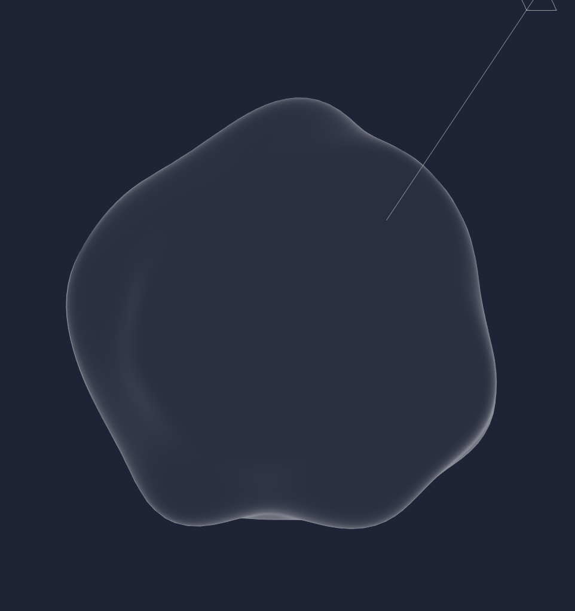
   
### At this point you have a glass blob (YAY! 🎉) You can customize it as you wish!
   \
Here are some cool effect to perfectionize the way your glass look :
- Add a B&W rainbow effect to create some depth :\
  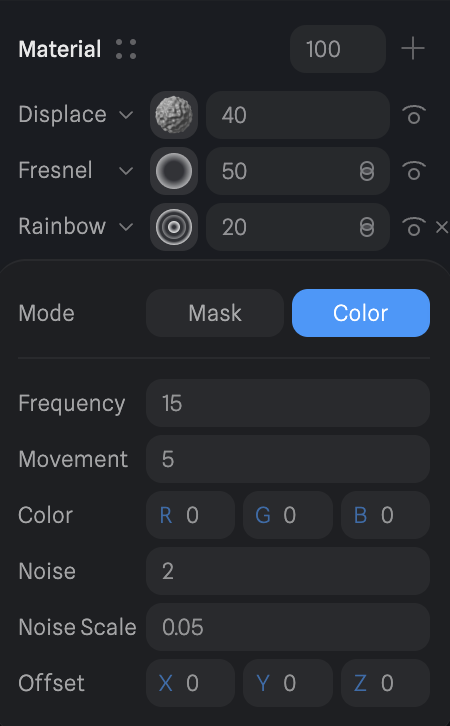
      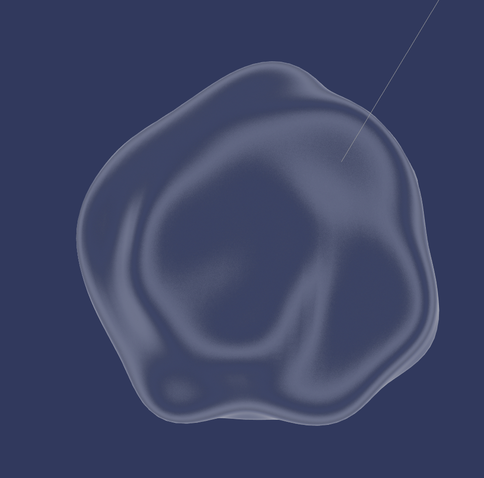
- Add a matcap to add some color reflection to your blob :\
  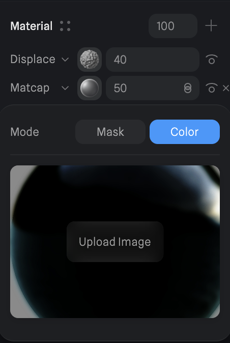
      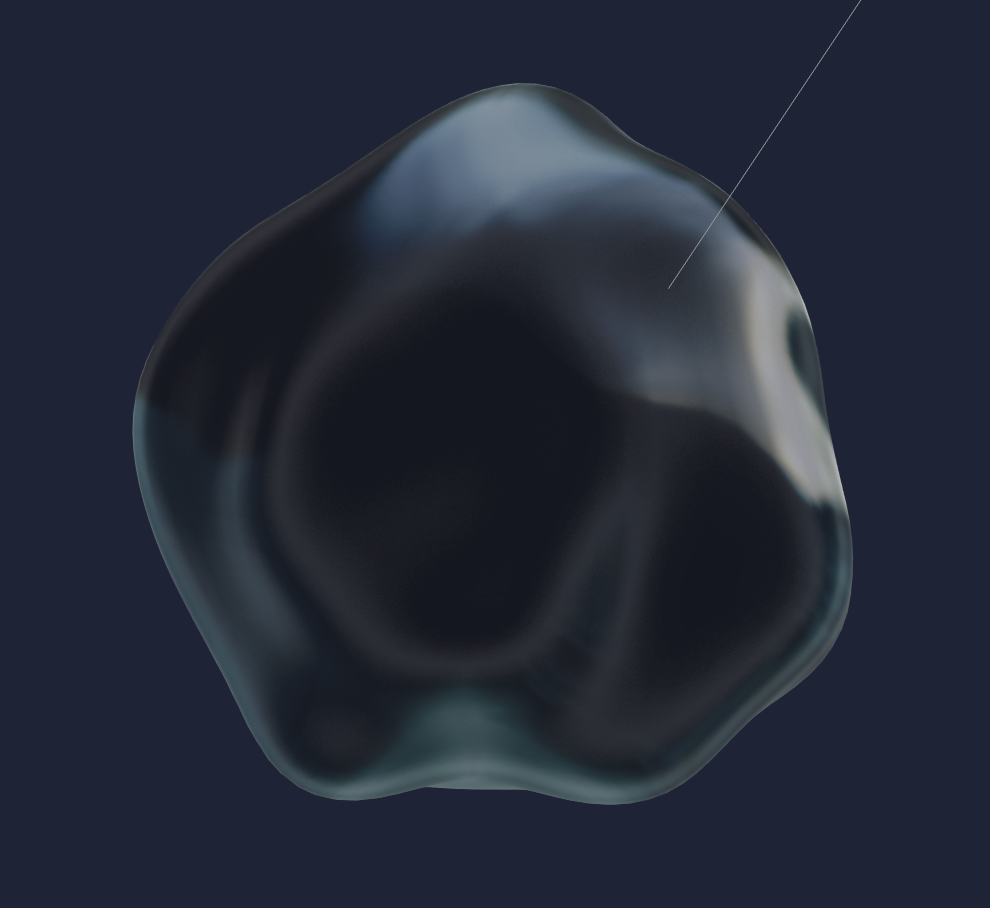\
(Your can create your own matcap by just creating a sphere and adding some color to it,\ then export it as a png like this one :)\
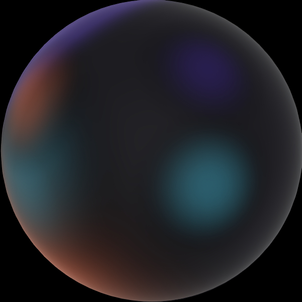
      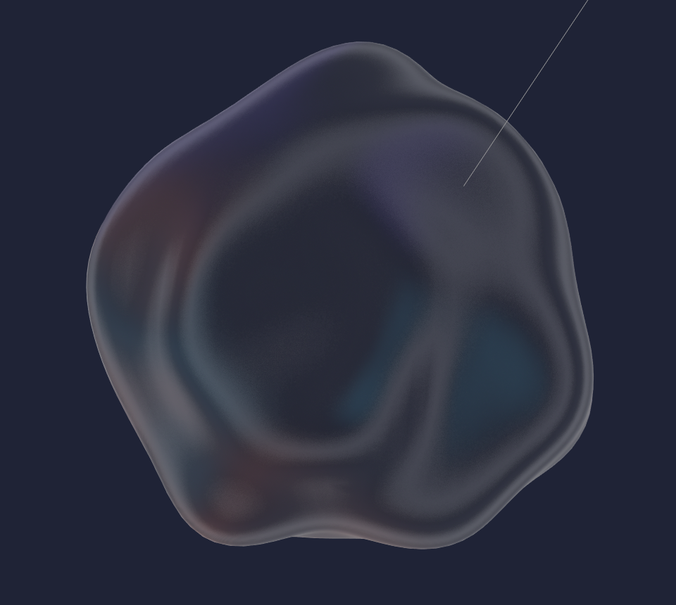

### Animating the blob
1. Create frames
2. Modifying value like the color, the position or some of the material for each frame
3. Create an event and set it to loop
4. Make the event transition between the frames

## Here's the final result

